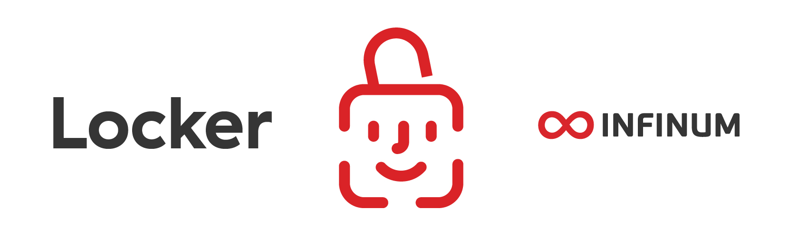

# **Locker 🔒** 

    


<p align="center">
    
</p>

## Description

Lightweight library for handling sensitive data (`String` type) in Keychain using iOS Biometric features.

  * Save data in Keychain.
  * Fetch data from Keychain with Biometric ID.
  * Delete data from Keychain.
  * There are additional methods that help you with saving and fetching some additional info regarding the authentication with biometric usage.
  * Detect changes in Biometric settings.
  * Check if device has support for certain Biometric ID.
  * Detect and supports Simulator.
  * Update the supported devices list without updating the library

Locker does not collect any user data. We have provided a [privacy manifest](https://github.com/infinum/Locker/blob/master/Sources/Locker/SupportingFiles/PrivacyInfo.xcprivacy) file that can be included in your app.

## Table of contents

* [Requirements](#requirements)
* [Getting started](#getting-started)
* [Usage](#usage)
* [Contributing](#contributing)
* [License](#license)
* [Credits](#credits)


## Requirements

- iOS 10.0 +

## Getting started

Locker supports CocoaPods, Swift Package Manager and Carthage.


#### CocoaPods

See installation instructions for [CocoaPods](http://cocoapods.org) if not already installed

To integrate the library into your Xcode project specify the pod dependency to your `Podfile`:

```ruby
platform :ios, '10.0'
use_frameworks!

pod 'Locker'
```

run pod install

```bash
pod install
```


#### Swift Package Manager

To install Locker from the Swift Package Manager, you should:
* In Xcode 11+ select File → Packages → Add Package Dependency
* Enter project's URL: https://github.com/infinum/Locker.git

For more information, check [Swift Package Manager](https://swift.org/package-manager/).


#### Carthage

For the Carthage installation and usage instruction, you can check official [quick start documentation](https://github.com/Carthage/Carthage#quick-start).

To integrate the library into your Xcode project, specify it in your `Cartfile`:

```
github "infinum/Locker"
```

Run `carthage update`.

## Usage

##### 0. Setup Xcode project `Info.plist` with required permission for **Face ID** usage.
- add following to your **Info.plist** from drop down menu
    - Privacy - Face ID usage description
    - after new field was added, provide meaningful description
- e.g. (when viewed as source code)
```xml
<key>NSFaceIDUsageDescription</key>
<string>** Add your Face ID Usage Description **</string>
```

##### 1. Save Your data with `setSecret: forUniqueIdentifier: completed:` method. 
For `uniqueIdentifier` pass `String` value You will later use to fetch Your data.
The `completed` is a closure that is called upon finished secret storage. If the error occurs upon storing, info will be passed through the completion block.

```objective-c
// Objective-C
[Locker setSecret:@"passcode" forUniqueIdentifier:@"kUniqueIdentifier" completed: ^(NSError *error) {
    //handle error
}];
```

```swift
// Swift
Locker.setSecret("passcode", for: "UniqueIdentifier", completed: { error in
    // handle error
})
```

> If Locker is run from the Simulator, instead of storing it into the Keychain, Locker will store data to the `UserDefaults`. You can check if Locker is running from the simulator with `isRunningFromTheSimulator` property.

 ##### 2. Fetch Your data with `retrieveCurrentSecretForUniqueIdentifier: operationPrompt: success: failure:`. 

`operationPrompt` is `String` value which will be displayed as message on system Touch ID dialog.
You'll get Your data in `success` completion block. If, for some reason, Your data is not found in Keychain, You'll get error status in `failure` completion block.

```objective-c
// Objective-C
[Locker retrieveCurrentSecretForUniqueIdentifier:@"kUniqueIdentifier" 
 operationPrompt:@"Touch ID description" success:^(NSString *secret) {
    // do sth with secret        
} failure:^(OSStatus failureStatus) {
    // handle failure
}];
```

```swift
// Swift
Locker.retrieveCurrentSecret(
  for: "kUniqueIdentifier", 
  operationPrompt: "Touch ID description", 
  success: { (secret) in
    // do sth with secret
  }, failure: { (failureStatus) in
    // handle failure
  }
)
```

##### 3. Delete data with `deleteSecretForUniqueIdentifier:` method.

```objective-c
// Objective-C
[Locker deleteSecretForUniqueIdentifier:@"kUniqueIdentifier"];
```

```swift
// Swift
Locker.deleteSecret(for: "kUniqueIdentifier")
```

##### 4. If You need to update Your saved data, just call `setSecret: forUniqueIdentifier: completed:`. This method first deletes old value, if there is one, and then saves new one. 

##### 5. There are some additional methods that may help You with handling the authentication with Biometric usage.

Use `setShouldUseAuthenticationWithBiometrics: forUniqueIdentifier:` method to save if Biometric ID should be used for fetching data from Keychain.
Use `shouldUseAuthenticationWithBiometricsForUniqueIdentifier:` method to fetch that info.

Use `setDidAskToUseAuthenticationWithBiometrics: forUniqueIdentifier:` method to save if user was asked to use Biometric ID for certain data.
Use `didAskToUseAuthenticationWithBiometricsForUniqueIdentifier:` method to fetch that info.

Use `setShouldAddSecretToKeychainOnNextLogin: forUniqueIdentifier:` method to save if data should be saved to Keychain on next user entering.
Use `shouldAddSecretToKeychainOnNextLoginForUniqueIdentifier:` method to fetch that info.

Note: This methods are here because they were used on some of our projects.
You should probably want to use the first two, `setShouldUseAuthenticationWithBiometrics: forUniqueIdentifier` and `shouldUseAuthenticationWithBiometricsForUniqueIdentifier`.
The other ones will be useful if Your app has certain behaviour.

##### 6. You can check for Biometrics settings changes with `biometricsSettingsDidChange`.
It will return `true` if Biometric settings are changed since Your last calling this method or last saving in Keychain.

```objective-c
// Objective-C
BOOL biometrySettingsChanged = Locker.biometricsSettingsDidChange;
BOOL usingBiometry = [Locker shouldUseAuthenticationWithBiometricsForUniqueIdentifier:@"kUniqueIdentifier"];
if (biometrySettingsChanged && usingBiometry) {
    // handle case when settings are changed and biometry should be used
}
```

```swift
// Swift
let biometrySettingsChanged = Locker.biometricsSettingsDidChange
let usingBiometry = Locker.shouldUseAuthenticationWithBiometrics(for: "kUniqueIdentifier")
if biometrySettingsChanged && usingBiometry {
// handle case when settings are changed and biometry should be used
}
```

##### 7. There are `supportedBiometricsAuthentication` and `configuredBiometricsAuthentication` computed properties which return `BiometricsType` enum (`BiometricsTypeNone`, `BiometricsTypeTouchID`, `BiometricsTypeFaceID`).
`supportedBiometricsAuthentication` checks if the device has support for some Biometric type.
`configuredBiometricsAuthentication` checks if the device has support for some Biometrics type and if that Biometric is enabled in device settings.

#### 8. There is a local JSON file that contains every iPhone and iPad model which has FaceID or TouchID. That way we can check if the user's device can use FaceID or TouchID. If you want to allow the JSON file to sync itself with a server, you can set `enableDeviceListSync` to `true`.
`enableDeviceListSync` when enabled, if the device is not present on the local list, it syncs the list with a list from the server and writes it down to the local JSON file.


## Contributing

Feedback and code contributions are very much welcome. Just make a pull request with a short description of your changes. By making contributions to this project you give permission for your code to be used under the same [license](https://github.com/infinum/Locker/blob/master/LICENSE).

## License

```text
MIT License

Copyright (c) 2024 Infinum

Permission is hereby granted, free of charge, to any person obtaining a copy
of this software and associated documentation files (the "Software"), to deal
in the Software without restriction, including without limitation the rights
to use, copy, modify, merge, publish, distribute, sublicense, and/or sell
copies of the Software, and to permit persons to whom the Software is
furnished to do so, subject to the following conditions:

The above copyright notice and this permission notice shall be included in all
copies or substantial portions of the Software.

THE SOFTWARE IS PROVIDED "AS IS", WITHOUT WARRANTY OF ANY KIND, EXPRESS OR
IMPLIED, INCLUDING BUT NOT LIMITED TO THE WARRANTIES OF MERCHANTABILITY,
FITNESS FOR A PARTICULAR PURPOSE AND NONINFRINGEMENT. IN NO EVENT SHALL THE
AUTHORS OR COPYRIGHT HOLDERS BE LIABLE FOR ANY CLAIM, DAMAGES OR OTHER
LIABILITY, WHETHER IN AN ACTION OF CONTRACT, TORT OR OTHERWISE, ARISING FROM,
OUT OF OR IN CONNECTION WITH THE SOFTWARE OR THE USE OR OTHER DEALINGS IN THE
SOFTWARE.
```

## Credits

Maintained and sponsored by [Infinum](https://infinum.com).

<div align="center">
    <a href='https://infinum.com'>
    <picture>
        <source srcset="https://assets.infinum.com/brand/logo/static/white.svg" media="(prefers-color-scheme: dark)">
        
    </picture>
    </a>
</div>